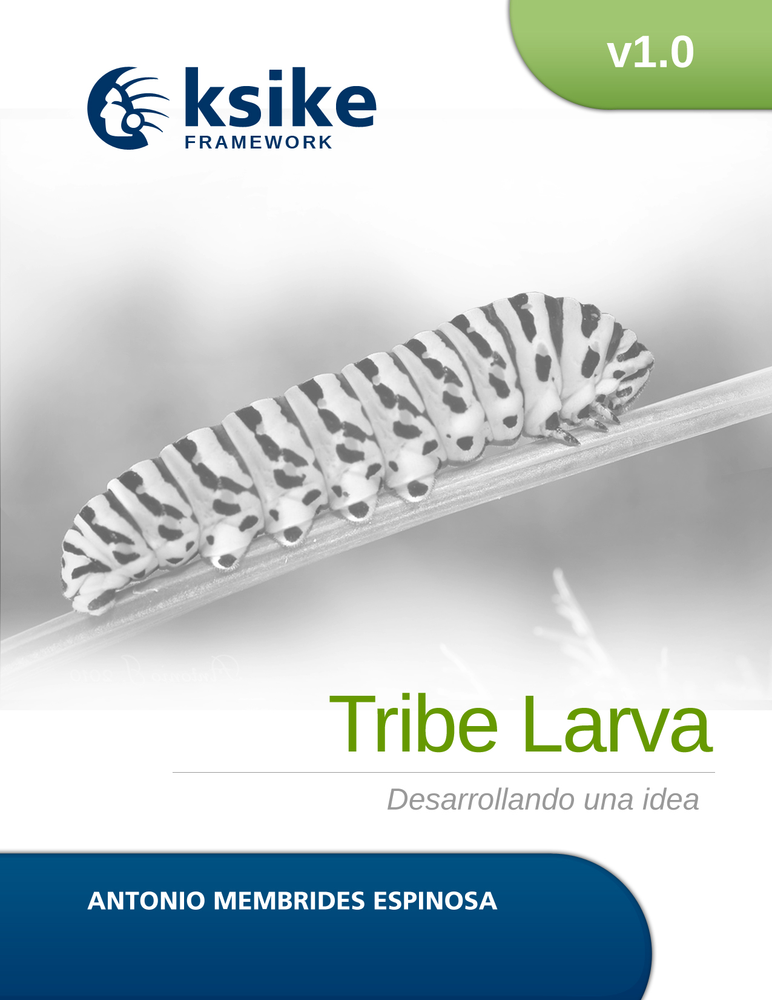

# Ksike Larva Web Framework 
First installment of the versioning series for the Ksike project, defines conceptual models of web application development.

Ksike arises as a need to obtain a platform for the construction of applications oriented to web environments, focused on maximizing performance and speeding up the development process. However, this should not decrease its strength, allowing it to support any type of system regardless of the business logic it needs to manage. Other elements to keep in mind is that it is highly extensible and promotes code consistency among developers. Starting from the idea that it promotes the development of software products based on the OOP2 paradigm and therefore all the advantages it provides.

[For more information read the book also known as Develop Manual](tools/help/manual.de.desarrollo-v1.0.pdf)

There are other editions of this framework oriented to other technologies such as PHP, JAVA, Python. The main idea is to keep the same concepts in the development of computer applications.

+ [Ksike Framework: Larva - focus on rich internet application development also known as RIA](https://github.com/ameksike/ksike.larva)
+ [Ksike Framework: Elephant - focus on PHP](https://github.com/ameksike/ksike.elephant)
+ [Ksike Framework: Rhino - focus on JavaScript and Node.js](https://github.com/ameksike/ksike.rhino.framework) 
+ [Ksike Framework: Coffee Cup - focus on Java](https://github.com/ameksike/ksike.java.core.plugin)

## ............................................................................

Primera entrega de la serie de versionado para el proyecto Ksike, define modelos conceptuales de desarrollo de aplicaciones web.

Ksike surge como necesidad de obtener una plataforma para la co nstrucción de aplicaciones orientadas a entornos web, enfocado en maximizar el rendimiento y agilizar el proceso de desarrollo. Sin embargo esto no debería de ir en decremento de la solidez del mismo, permitiendo soportar cualquier tipo de sistema indiferentemente de la lógica de negocio que este necesite gestionar. Otros de los elementos a tener en cuenta es que es sumamente extensible y fomenta la consistencia de código entre los desarrolladores. Partiendo de la idea de que potencia el desarrollo de productos de software basados en el paradigma de OOP y por ende todas las ventajas que este provee. 

## ............................................................................

